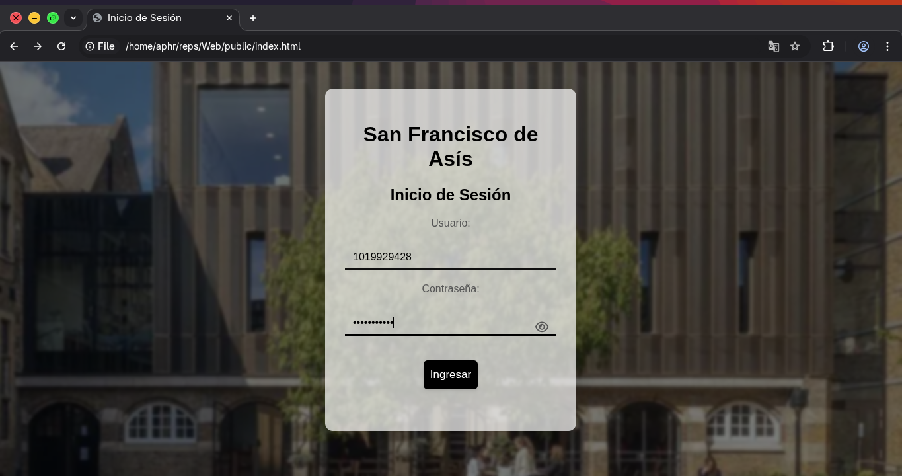
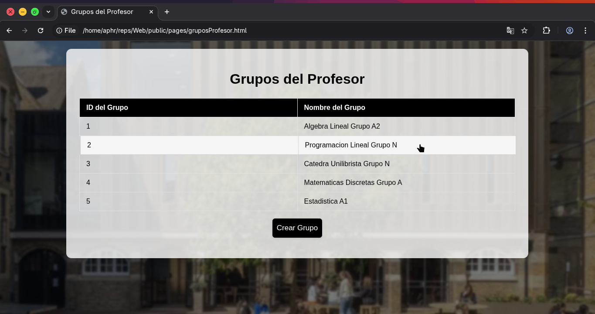
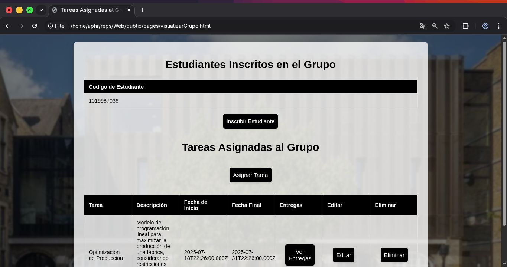
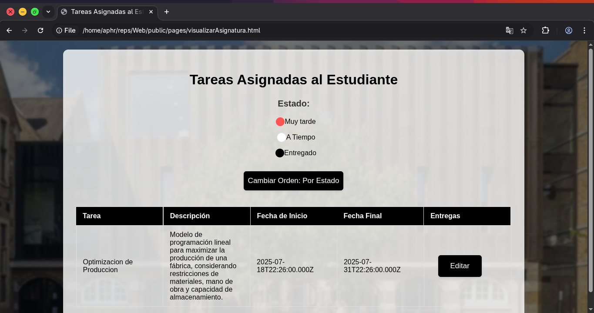
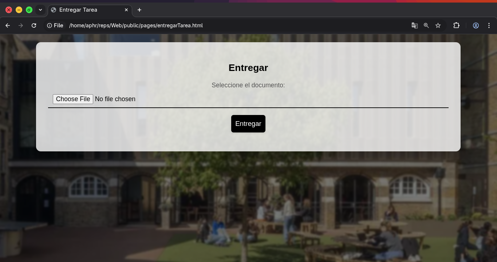

# SchoolWebPro - San Francisco de Asis

Full Stack Project: School management web platform. Built with Vanilla CSS, JavaScript, ExpressJS, and powered by MySQL. Microservices architecture.


## Execution Instructions

**1. Base de datos (Docker):**
```bash
cd backend
docker-compose up -d
```

**2. Backend (microservicios):**
```bash
cd backend
npm install
npm start
```

**3. Frontend:**
```bash
cd frontend
npm start
```

Abre `http://localhost:5500` en el navegador.

## In Action Screenshots






